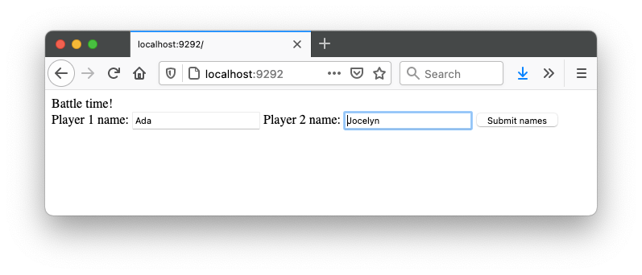
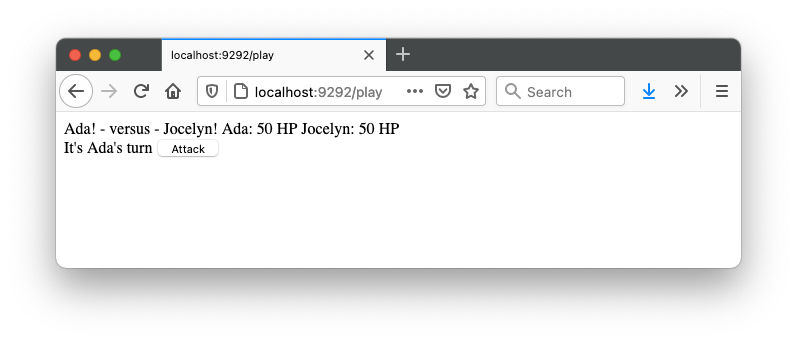
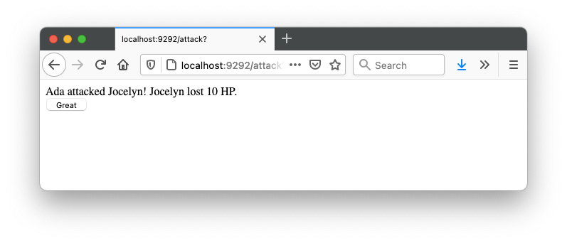

## Battle
A turn-based battle game for the web.

### Description
I wrote this code following an Introduction to the Web walkthrough, in week 3 of the 12-week [Makers Academy](https://makers.tech) coding bootcamp. It was an introduction to several new concepts:
* HTTP requests  
* The Ruby-based Sinatra web framework  
* The Model - View - Controller pattern  
* ERB (Embedded Ruby) syntax  
* Feature/integration tests, using Capybara and Rspec  

The game is very simple. Players enter their names and can take it in turns to attack each other until one of them wins. Unfortunately all attacks currently do 10 HP of damage, so it's not a very interesting game!  

### Installation and Usage
To try out the project:
* Make sure Ruby 3.0.0 is installed
* Clone this repo
* Navigate into the cloned folder
* Run `bundle` to install the dependencies
* Run `rackup` to start the local server
* In your browser, go to `localhost:9292`
* Play the game!
* To run the tests, run `rspec` in the terminal
  
Here are some screenshots of the code in action:
  
  
  
